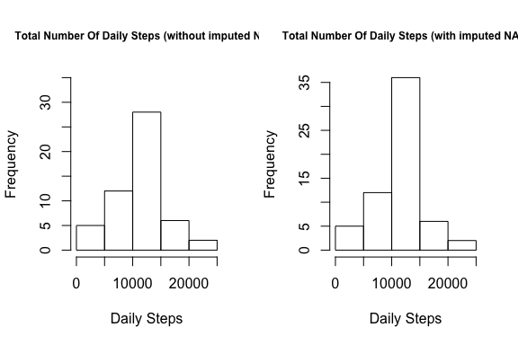
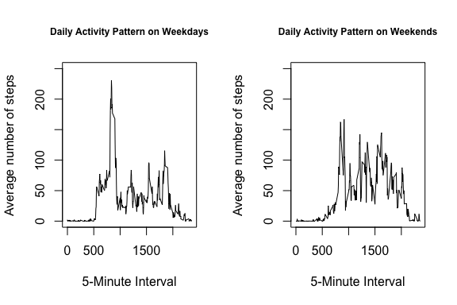

# Reproducible Research - Assignment 1
Anna Berman  
June 12, 2016  


```r
library(knitr)
```


```r
#download dataset
fileUrl <- "https://d396qusza40orc.cloudfront.net/repdata%2Fdata%2Factivity.zip"
file <- "./activityData.zip"
if(!file.exists(file)){
  download.file(fileUrl, destfile = file, method = "curl")
}

#unzip files
datafile <- "activity.csv"
if(!file.exists(datafile)){
  print("unzip file")
  unzip(file, list = FALSE, overwrite = TRUE)
}

activity <- read.csv(datafile, stringsAsFactors = FALSE)
activity$date <- as.Date(activity$date)

#NA handling
activity_rm <- activity
activity_rm <- activity[which(!is.na(activity$steps)),]
```

##What is mean total number of steps taken per day?
Calculating the total number of steps taken per day

```r
#sum steps
dailySteps <- tapply(activity_rm$steps, activity_rm$date, sum)
hist(dailySteps, main = "Total Number Of Daily Steps", xlab = "Daily Steps")
```


Calculating the mean and median of the total number of steps taken per day

```r
mean <- mean(dailySteps, na.rm = TRUE)
median <- median(dailySteps, na.rm = TRUE)
```
The mean is 1.0766189\times 10^{4} and the median is 10765. 

##What is the average daily activity pattern?
Make a time series plot of the 5-minute interval and the average number of steps taken, averaged across all days.

```r
#calculate mean interval activity
dailyact <- tapply(activity_rm$steps, activity_rm$interval, mean)

#plot
plot(y = dailyact, x = names(dailyact), type = "l", xlab = "5-Minute-Interval", 
    main = "Daily Activity Pattern", ylab = "Average number of steps")
```


```r
#calculate max interval
max <- max(dailyact)
maxInt <- as.numeric(names(which(dailyact == max)))
```
The inteval with the max average step count is interval 835.

##Imputing missing values


```r
#Calculate the number of missing elements
naNum <- sum(is.na(activity$steps))
dailyact["835"]
```

```
##      835 
## 206.1698
```

```r
#replace NAs with interval average
activity_full <- activity
nas <- is.na(activity_full$steps)
activity_full$steps[nas] <- dailyact[as.character(activity_full$interval[nas])]
```
The there are 2304 intervals with no data in the dataset.

Make a histogram and calculate the new means and medians for each day.

```r
#sum steps
dailySteps_full <- tapply(activity_full$steps, activity_full$date, sum)
hist(dailySteps_full, main = "Total Number Of Daily Steps (with imputed NAs)", xlab = "Daily Steps")
```



```r
mean_full <- mean(dailySteps_full)
median_full <- median(dailySteps_full)
```
The mean is 1.0766189\times 10^{4} and the median is 1.0766189\times 10^{4}. 

What changes when you remove the NAs?

```r
par(mfrow=c(1,2), cex.main= .75)
hist(dailySteps, main = "Total Number Of Daily Steps (without imputed NAs)", 
     xlab = "Daily Steps", ylim = c(0, 35))
hist(dailySteps_full, main = "Total Number Of Daily Steps (with imputed NAs)",
     xlab = "Daily Steps")
```



##Are there differences in activity patterns between weekdays and weekends?

```r
#create weekend/weekday variable
activity_full$weekday <- weekdays(activity_full$date)
activity_full$fwd <- as.factor(c("weekend", "weekday"))
activity_full$fwd[activity_full$weekday == "Saturday" | 
    activity_full$weekday ==  "Sunday"] <- factor("weekend")
activity_full$fwd[!(activity_full$weekday == "Saturday" | 
    activity_full$weekday == "Sunday")] <- factor("weekday")

#subset the weekend vs. weekday datasets
activity_full_weekend <- subset(activity_full, fwd == "weekend") 
activity_full_weekday <- subset(activity_full, fwd == "weekday") 
dailyact_weekend<-tapply(activity_full_weekend$steps, activity_full_weekend$interval, mean)
dailyact_weekday<-tapply(activity_full_weekday$steps, activity_full_weekday$interval, mean)

#plot the differences in average interval activity
par(mfrow=c(1,2), cex.main= .75)
plot(y = dailyact_weekday, x = names(dailyact_weekday), type = "l", 
     xlab = "5-Minute Interval", main = "Daily Activity Pattern on Weekdays", 
     ylab = "Average number of steps",  ylim =c(0, 250))
plot(y = dailyact_weekend, x = names(dailyact_weekend), type = "l", 
     xlab =  "5-Minute Interval",  main = "Daily Activity Pattern on Weekends", 
     ylab = "Average number of steps",  ylim =c(0, 250))
```


